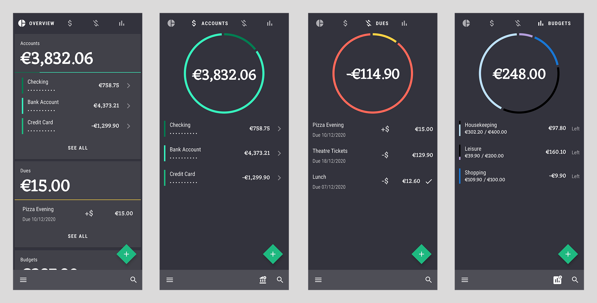

# MoneyBook - Stay on top of your finances.

MoneyBook is an open-source finance manager, inspired by Google's Material Design Study [Rally](https://material.io/design/material-studies/rally.html).

##### Download available on Google Play:

## Features

- Create transactions and assign them to accounts, to always have an eye on your current balance.
- Get reminded about claims and debts using the reminder feature when entering a due.
- Assign contacts to dues, and send them a reminder message directly within the app.
- Create monthly budgets and organize your expenses. Always have an overview on what's left.
- Stay safe and private. MoneyBook does not touch or collect any of your personal data or transactions.

## Screenshots

## Contribute

If you have any ideas, or found a bug, feel free to submit an issue or open a pull-request.
